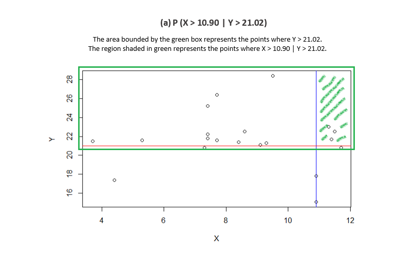
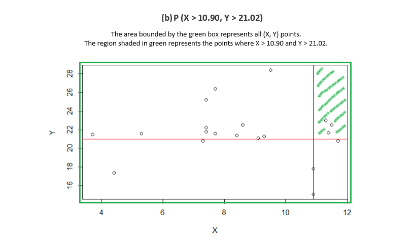
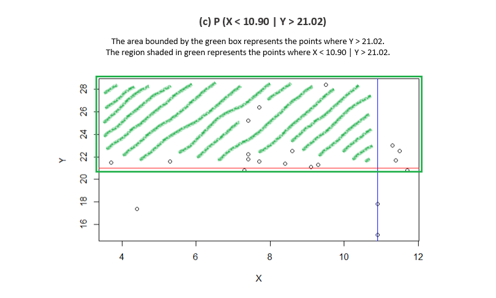

```{r setup, include=FALSE}
knitr::opts_chunk$set(echo = TRUE)
```

---

```{r echo=FALSE}
library(knitr)
```

### <span Style="color:blue">Problem 1</span>

Pick one of the quantitative independent variables (Xi) from the data set below, and define that variable as  X. Also, pick one of the dependent variables (Yi) below, and define that as Y.

- For my independent variable X, I've selected <b>X3</b>.
- For my dependent variable Y, I've selected <b>Y3</b>. 

<b>X</b> = X3 = {9.5, 3.7, 11.7, 7.4, 5.3, 7.4, 7.4, 8.6, 9.1, 11.4, 8.4, 7.3, 11.3, 4.4, 9.3, 10.9, 10.9, 7.7, 7.7, 11.5}

<b>Y</b> = Y3 = {28.4, 21.5, 20.8, 22.2, 21.6, 21.8, 25.2, 22.5, 21.1, 21.7, 21.4, 20.8, 23.0, 17.4, 21.3, 15.1, 17.8, 26.4, 21.6, 22.5}

Calculate as a minimum the below probabilities a through c.  Assume the small letter "x" is estimated as the <b>3rd quartile</b> of the `X` variable, and the small letter "y" is estimated as the <b>1st quartile</b> of the `Y` variable.  Interpret the meaning of all probabilities.

- a.  P(X>x | Y>y)		

- b.  P(X>x, Y>y)		

- c.  P(X<x | Y>y)	


#### Assign `X` and `Y` values to their respective vectors. 

```{r}
X <- c(9.5, 3.7, 11.7, 7.4, 5.3, 7.4, 7.4, 8.6, 9.1, 11.4, 8.4, 7.3, 11.3, 4.4, 9.3, 10.9, 10.9, 7.7, 7.7, 11.5)

Y <- c(28.4, 21.5, 20.8, 22.2, 21.6, 21.8, 25.2, 22.5, 21.1, 21.7, 21.4, 20.8, 23.0, 17.4, 21.3, 15.1, 17.8, 26.4, 21.6, 22.5)
```

#### Summary of `X`. 

- The 3rd quartile (Q3) of `X` is 10.90. 
- There are 20 values in `X`. 

```{r}
summary(X)
length(X)
```


#### Summary of `Y`. 

- The 1st quartile (Q1) of of `Y` is 21.02.
- There are 20 values in `Y`. 

```{r}
summary(Y)
length(Y)
```

### Plot of `X` and `Y`. 

- Below is plot of (`X`,`Y`). 
- The blue vertical line is `X = 10.90`, which is the 3rd quartile of `X`. 
- The red horizontal line is `Y = 21.02`, which is the 1st quartile of `Y`.


```{r echo=FALSE}
plot(X,Y)

X_Q3 <- 10.90
Y_Q1 <- 21.02

abline(v = X_Q3, col="blue")
abline(h = Y_Q1, col="red")
```


### Answers to Probabilities

Please see below for details of calculations. 


<b>Q3 of X</b> =  10.90 

<b>Q1 of Y</b> =  21.02


(a)  P(X > 10.90 | Y > 21.02)   <span style="color:green"><b>Answer</b>: 1/5 or 0.20</span>
(b)  P(X > 10.90, Y > 21.02)    <span style="color:green"><b>Answer</b>: 3/20 or 0.15</span>
(c)  P(X < 10.90 | Y > 21.02)   <span style="color:green"><b>Answer</b>: 12/15 or 0.80</span>


### Interpretation and Calculation of the Probabilities 

#### <span style="color:blue">Table A: Shows all 20 (x,y) points in the dataset</span>

```{r}
XY <- data.frame(X,Y)
kable(XY)
nrow(XY)
```

<br/> 

#### (a)  P(X > 10.90 | Y > 21.02)		

Below calculates the conditional probability that X > 10.90 given Y > 21.02. 



#### <span style="color:blue">Table B: Shows the 15 (x,y) points where Y > 21.02 </span>

```{r}
XY_subset1 <- subset(XY, Y > 21.02, select=c("X", "Y"))
rownames(XY_subset1) <- c()
kable(XY_subset1, row.names=NA)
nrow(XY_subset1)
```


#### <span style="color:blue">Table C: Shows the 3 (x,y) points where X > 10.90 and Y > 21.02 </span>

```{r}
XY_subset2 <- subset(XY, X > 10.90 & Y > 21.02, select=c("X", "Y"))
rownames(XY_subset2) <- c()
kable(XY_subset2)
nrow(XY_subset2)
```

#### <span style="color:green">Answer: So, P(X > 10.90 | Y > 21.02) is 3/15 or 1/5 or 0.20. </span>

```{r}
nrow(XY_subset2)/nrow(XY_subset1)
```

<br/>

#### (b)  P(X > 10.90, Y > 21.02)	

Below calculates the probability that X > 10.90 *and* Y > 21.02. 




In part (a) above we already know that there are <b>3</b> points where X > 10.90 *and* Y > 21.02. See *Table C*. 

We also know that there is a total of <b>20</b> points in the `XY` universe. See *Table A*. 

#### <span style="color:green">Answer: So, P(X > 10.90 *and* Y > 21.02) is 3/20 or 0.15. 

```{r}
nrow(XY_subset2)/nrow(XY)
```

<br/> 

#### (c) P(X < 10.90 | Y > 21.02)	

Below calculates the conditional probability that X < 10.90 given that Y > 21.02. 



#### <span style="color:blue">Table D: Shows the 12 (x,y) points where X < 10.90 and Y > 21.02 </span>

```{r}
XY_subset3 <- subset(XY, X < 10.90 & Y > 21.02, select=c("X", "Y"))
rownames(XY_subset3) <- c()
kable(XY_subset3)
nrow(XY_subset3)
```

In part (a) above, we already know that there are 15 (x,y) points where Y > 21.02. See *Table B*. 

#### <span style="color:green">Answer: So, P(X < 10.90 | Y > 21.02)	is 12/15 or 0.80. </span>

```{r}
nrow(XY_subset3)/nrow(XY_subset1)
```

---

<br/>

#### <span style="color:blue">Table E: Shows count of each segment </span>

```{r}
Y_less_or_equal_Q1 <- subset(XY, Y <= 21.02, select=c("X", "Y"))
Y_greater_Q1 <- subset(XY, Y > 21.02, select=c("X", "Y"))
row1 <- c(nrow(subset(Y_less_or_equal_Q1, X <= 10.90)), nrow(subset(Y_less_or_equal_Q1, X > 10.90)))
row2 <- c(nrow(subset(Y_greater_Q1, X <= 10.90)), nrow(subset(Y_greater_Q1, X > 10.90)))
rows <- rbind(row1, row2)
rows <- cbind(rows, rowSums(rows))
rows <- rbind(rows, colSums(rows))
rownames(rows) <- c('X <= 1st quartile', 'X > 1st quartile', 'Total')
colnames(rows) <- c('Y <= 3rd quartile', 'Y > 3rd quartile', 'Total')
kable(rows)
```

---

#### Does splitting the training data in this fashion make them independent? 

Let `A` be the new variable counting those observations *above* the `1st quartile for X,` and let `B` be the new variable counting those observations *above* the `1st quartile for Y`.   

Does P(AB) = P(A)P(B)?

Check mathematically, and then evaluate by running a Chi Square test for independence.


- The 1st quartile of X is 7.40 (information under "Summary of x" section). 
- The 1st quartile of Y is 21.02 (information under "Summary of Y" section)

<br/>

#### Plot of (x, y)

- The blue vertical line is `X = 7.40`, which is the 1st quartile of `X`. 
- The red horizontal line is `Y = 21.02`,  which is the 1st quartile of `Y`. 


```{r echo=FALSE}
plot(X,Y)

X_Q1 <- 7.40
Y_Q1 <- 21.02

abline(v = X_Q1, col="blue")
abline(h = Y_Q1, col="red")
```

#### <span style="color:blue">Table F: Shows the 13 (x,y) points where X > 7.40 </span>

```{r}
A <- subset(XY, X > 7.40, select=c("X", "Y"))
rownames(A) <- c()
kable(A)
nrow(A)
```

<br/> 

#### <span style="color:blue">Table G: Shows the 15 (x,y) points where X > 7.40 </span>

```{r}
B <- subset(XY, Y > 21.02, select=c("X", "Y"))
rownames(B) <- c()
kable(B)
nrow(B)
```


<br/> 

#### <span style="color:blue">Table H: Shows the 10 (x,y) points where X > 7.40 and Y > 21.02 </span>

```{r}
AB <- subset(XY, X > 7.40 & Y > 21.02, select=c("X", "Y"))
rownames(AB) <- c()
kable(AB)
nrow(AB)
```

#### P(A) = 13/20 or 0.65

```{r}
nrow(A)/nrow(XY)
```

#### P(B) = 15/20 or 0.75

```{r}
nrow(B)/nrow(XY)
```

#### P(AB) = 10/20 = 0.50

```{r}
nrow(AB)/nrow(XY)
```

#### Does P(AB)=P(A)P(B)?

P(AB) = 0.50
P(A)P(B) = 0.4875

#### <span style="color:green">As you can see P(AB) != P(A)P(B), which means that A and B are not independent. So, splitting the data in this fashion does not make them independent, </span>


```{r}
prob_A <- 0.65
prob_B <- 0.75
prob_A * prob_B
```

<br/>

### Evaluate by running a Chi-Square test for independence

<br/>

For this test, I broke down the data points into 2 categories. Category 1 has 2 levels: `A` and `Not-A`. Category 2 has 2 levels: `B` and `Not-B`. 
A data point (x,y) is in `A` if X > 7.40 otherwise it's in `Not-A`. A data point (x,y) is in `B` if Y > 21.02 otherwise it's in `Not-B`. So each (x,y) point is assigned to a specific level for each category.


#### <span style="color:blue">Table H: Contingency table by 2 Categories</span>

```{r}
XY$A[XY$X > 7.40] <- 'A'
XY$B[XY$Y > 21.02] <- 'B'
XY$A[XY$X <= 7.40] <- 'Not-A'
XY$B[XY$Y <= 21.02] <- 'Not-B'
AB_table <- table(XY$A, XY$B)
kable(AB_table)
```

The null hypothesis is category 1 and category 2 are independent (no relationship exists between the 2 categories) 

The alternative is category 1 and category 2 are not independent (a relationship exists between the 2 categories) 

The significance level is 0.05. 


```{r}
result <- chisq.test(AB_table)
result
```


The results of the Pearson's chi-squared test shows a chi-square statistic of 0, which suggests that there is no difference between the actual and expected data, and that any difference between the actual and expected data is due to chance. Below you will see the expected and actual data. 

#### Expected data: 

```{r}
result$expected
```

#### Actual data: 

```{r}
AB_table
```

The p-value is 1, which is greater than the significance level of 0.05, which means that we fail to reject the null hypothesis that the 2 categories are independent. 

The result suggests that there is no significant relationship between the two categories (they are independent); however, chi-square tests are sensitive to sample size and frequency count of each cell. <b> The contingency table should have at least a frequency of 5 when doing a chi-square test </b>. As you can see, the actual data has frequencies that are less than 5. In addition, the chi-square test also presents a warning stating that the chi-squared approximation may be incorrect. 


I would have to conclude that the result of this chi-square test is not reliable since we do not have sufficient data to perform this test. 

Sources: 

https://stattrek.com/chi-square-test/independence.aspx

https://www.statisticssolutions.com/using-chi-square-statistic-in-research/


